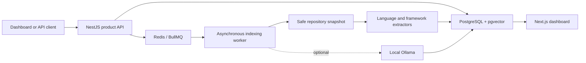

# IntelliRepo architecture

This document explains the runtime architecture for contributors and interview reviewers.

## Runtime flow

PostgreSQL is canonical. A scan stages facts by repository and revision, validates the snapshot has not changed, and atomically activates the new revision. Unaffected facts remain available during incremental updates. Failed semantic projection degrades the scan but does not invalidate deterministic facts.

## Module boundaries

- `packages/repository` enforces allowed roots, file limits, UTF-8, symlink containment, Git diffs, and content-sensitive snapshots.
- `packages/parsing` extracts normalized artifacts, entities, relationships, routes, build metadata, and configuration facts.
- `packages/catalog` owns PostgreSQL migrations and durable repositories, revisions, jobs, facts, projections, findings, reviews, and tasks.
- `packages/indexing` owns submission, outbox dispatch, leases, stages, activation, semantic projection, and revision analysis.
- `packages/graph` provides bounded repository-scoped traversal over canonical PostgreSQL relationships.
- `packages/impact` computes semantic changes, affected components, tests, and explainable risk.
- `packages/documentation` parses claims, measures health, and creates reviewable Markdown diffs.
- `packages/embeddings`, `packages/ai`, and `packages/qa` provide selective pgvector retrieval and optional Ollama-backed cited answers.
- `apps/api`, `apps/worker`, and `apps/web` compose those modules without duplicating domain rules.

## Consistency model

Canonical activation is transactional. Async jobs use durable leases and compare-and-set transitions, while an outbox prevents a committed scan request from being lost between PostgreSQL and BullMQ. Projection records expose the canonical revision, projected revision, lag, and failure/degraded state. Question tasks and documentation reviews survive API restarts.

## Trust boundaries

Repository text is evidence, not instruction. Traversal intents are allowlisted and bounded. File reads remain within configured roots, symlink escapes are rejected, secret-like content is redacted before embedding or generation, and all queries are scoped by repository and revision. Generated documentation is previewed and applied only after explicit acceptance.
