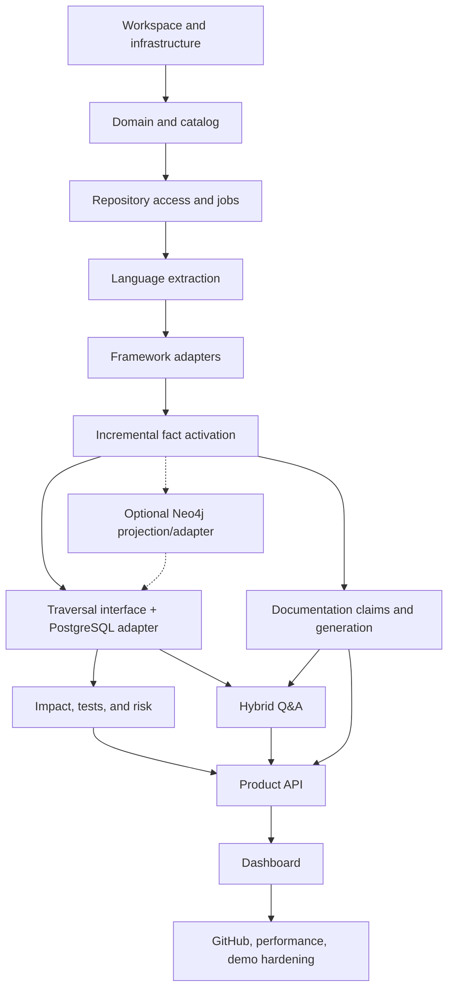

# IntelliRepo Portfolio Vertical Slice Implementation Plan

> Historical plan: the approved 2026-07-21 runtime integration design supersedes this document's optional Neo4j projection tasks. The implemented portfolio slice uses PostgreSQL for canonical storage and traversal, with pgvector in the same database and no Neo4j runtime or adapter.

**Design baseline:** `docs/superpowers/specs/2026-07-15-intellirepo-portfolio-vertical-slice-design.md`

**Architecture revision:** 2026-07-16

**Target:** Twelve-week solo build

**Architecture:** TypeScript modular monolith with Next.js, NestJS, BullMQ workers, mandatory PostgreSQL/pgvector and Redis, plus optional Neo4j and Ollama adapters

## 1. Delivery rules

1. Build one demonstrable vertical path at a time. A module is not complete until its interface, implementation, tests, diagnostics, and one caller work together.
2. Keep PostgreSQL mandatory and canonical. Run pgvector in the same PostgreSQL service; do not introduce a separate vector database.
3. Keep Neo4j optional and rebuildable behind the graph traversal interface. Deterministic features must fall back to canonical PostgreSQL relationships when Neo4j is disabled, unavailable, or stale.
4. Keep deterministic analysis authoritative and operational without Ollama. Ollama may summarize, explain, classify bounded input, or draft prose; it must not invent repository facts.
5. Embed only selected redacted source spans and documentation sections. Do not create embeddings for every entity or relationship.
6. Require provenance for every source-derived fact and confidence for every inferred relationship.
7. Add a failing test or fixture expectation before implementing each extractor, resolver, rule, or recovery path.
8. Preserve a usable local demo at the end of every week.
9. Do not expand deferred scope unless a release acceptance criterion cannot be met without it.

## 2. Planned technology choices

The bootstrap task must pin compatible versions in the lockfile. The plan intentionally avoids floating global tooling.

- pnpm workspaces and Turborepo for the monorepo.
- TypeScript strict mode throughout.
- NestJS for API and standalone workers.
- Next.js for the dashboard.
- Kysely plus reviewed SQL migrations for PostgreSQL and pgvector.
- `neo4j-driver` only for the optional graph projection and traversal adapter.
- BullMQ with Redis for durable jobs.
- Zod schemas for module and job contracts.
- Tree-sitter grammars for Java and Kotlin; TypeScript Compiler API for TypeScript; Tree-sitter fallback for incomplete TypeScript.
- Vitest for unit and contract tests.
- Testcontainers for mandatory PostgreSQL/pgvector and Redis integration tests, plus an optional Neo4j equivalence suite.
- Playwright for browser acceptance tests.
- Ollama HTTP interfaces for generation and embeddings.
- Octokit for optional GitHub pull request access.
- Cytoscape.js or React Flow behind a local graph-view adapter; select one during the dashboard spike and do not expose the library in server contracts.

## 3. Target repository structure

```text
.
├── apps/
│   ├── api/
│   ├── web/
│   └── worker/
├── packages/
│   ├── ai/
│   ├── catalog/
│   ├── contracts/
│   ├── documentation/
│   ├── domain/
│   ├── embeddings/
│   ├── graph/
│   ├── impact/
│   ├── observability/
│   ├── parsing/
│   ├── qa/
│   ├── repository/
│   ├── testkit/
│   └── tsconfig/
├── examples/
│   ├── spring-auth/
│   ├── ktor-orders/
│   ├── vertx-notifications/
│   ├── nest-payments/
│   ├── express-users/
│   └── changes/
├── scripts/
│   ├── demo/
│   └── fixtures/
├── tests/
│   ├── e2e/
│   └── performance/
├── docker-compose.yml
├── pnpm-workspace.yaml
└── turbo.json
```

## 4. Module interfaces and ownership

| Module          | Owns                                                                               | Must not own                   |
| --------------- | ---------------------------------------------------------------------------------- | ------------------------------ |
| `domain`        | Entity/relationship model, identity, confidence, provenance, change-set types      | SQL, Cypher, AST libraries     |
| `repository`    | Safe repository access, Git revisions/diffs, discovery inputs                      | Parsing or graph semantics     |
| `parsing`       | Language parsing, framework adapters, normalization, symbol-resolution diagnostics | Direct database writes         |
| `catalog`       | Canonical facts, revisions, jobs, docs, claims, outbox transactions                | Graph traversal or model prose |
| `graph`         | Traversal interface, PostgreSQL adapter, optional Neo4j projection/adapter/state   | Canonical truth                |
| `embeddings`    | Selective source/doc chunks, redaction, pgvector projection, semantic retrieval    | Structural conclusions         |
| `impact`        | Semantic diff, affected subgraph, test ranking, documentation impact, risk         | AST parsing or UI formatting   |
| `documentation` | Markdown claims, deterministic stale/gap rules, generation plans, review diffs     | Automatic merge                |
| `qa`            | Intent routing, evidence packs, answer validation                                  | Unrestricted Cypher            |
| `ai`            | Ollama generation/embedding adapters, schema validation, degraded state            | Repository-specific rules      |

## 5. Canonical storage outline

The first migration set should establish these logical records. Column details may evolve, but ownership and keys should not.

- `repositories`: registered root, display name, default branch, settings.
- `revisions`: commit SHA, worktree fingerprint, parent revision, status.
- `source_artifacts`: normalized path, kind, language, content hash, size, active revision.
- `entities`: stable key, kind, name, qualified name, attributes, first/last revision.
- `relationships`: source, target, kind, attributes, first/last revision.
- `provenance`: fact reference, artifact, line/column range, extractor, evidence, confidence.
- `fact_staging_runs`: staged extraction result before activation.
- `scan_jobs` and `job_attempts`: state machine, stage, error, retry, timing.
- `outbox_events`: idempotent projection and downstream-analysis events.
- `projection_states`: repository/revision, lag, availability, and degraded state for optional Neo4j and semantic projections.
- `document_pages`, `document_sections`, and `document_claims`.
- `documentation_findings` and `documentation_reviews`.
- `semantic_chunks`: eligible source/doc identity, checksum, redacted content, embedding, and chunk-selection reason.
- `impact_reports`, `test_recommendations`, and `risk_factors`.
- `question_sessions`, `questions`, and validated answer references.

Entity and relationship uniqueness must include repository identity. Artifact-owned facts must be replaceable in one transaction. Outbox event keys must prevent duplicate projection effects.

## 6. Twelve-week execution plan

### Week 1 — Monorepo and executable skeleton

#### Task 1.1: Bootstrap the workspace

**Create**

- `package.json`
- `pnpm-workspace.yaml`
- `turbo.json`
- `.editorconfig`
- `.gitignore`
- `.env.example`
- shared TypeScript, ESLint, and formatter configuration
- skeletons for `apps/api`, `apps/worker`, and `apps/web`

**Implement**

- Root commands for build, typecheck, lint, unit tests, integration tests, and end-to-end tests.
- Strict TypeScript project references between applications and packages.
- Health endpoints for API and worker startup diagnostics.

**Verify**

- Clean install produces a reproducible lockfile.
- `build`, `typecheck`, `lint`, and an initial smoke test pass from the root.
- Applications cannot import another package's implementation-only paths.

**Checkpoint commit:** `chore: bootstrap IntelliRepo monorepo`

#### Task 1.2: Add local infrastructure

**Create**

- `docker-compose.yml`
- Compose health checks and named volumes.
- Development configuration loaders in `packages/contracts`.

**Implement**

- Mandatory PostgreSQL with pgvector and Redis, with Neo4j and Ollama as independent optional profiles.
- Validated configuration for connection URLs, repository allowlist roots, file limits, model names, timeouts, and concurrency.
- A root `doctor` command that verifies mandatory dependencies and reports Neo4j projection status and degraded Ollama operation separately.

**Verify**

- Compose reaches healthy state from clean volumes.
- The API and worker report each dependency independently.
- Structural and deterministic features start with PostgreSQL/Redis only; missing Neo4j or Ollama is reported without failing startup.

**Checkpoint commit:** `chore: add local development services`

#### Task 1.3: Establish the domain model

**Create**

- `packages/domain/src/entities.ts`
- `packages/domain/src/relationships.ts`
- `packages/domain/src/provenance.ts`
- `packages/domain/src/confidence.ts`
- `packages/domain/src/identity.ts`
- `packages/domain/src/change-set.ts`
- matching unit tests

**Implement**

- Discriminated unions for initial entity and relationship kinds.
- Deterministic stable-key generation.
- Confirmed/inferred/tentative confidence invariants.
- Line/column source ranges and extractor diagnostics.
- Change-set records for add, modify, delete, and rename.

**Verify**

- Identity is stable across repeated extraction and content-only edits.
- Repository identity prevents cross-repository collisions.
- Anonymous syntax paths remain deterministic.
- Invalid provenance or confidence is rejected at construction.

**Checkpoint commit:** `feat(domain): define canonical intelligence model`

### Week 2 — Catalog, Git access, and job lifecycle

#### Task 2.1: Implement canonical catalog migrations

**Create**

- `packages/catalog/migrations/`
- `packages/catalog/src/database.ts`
- repository, revision, artifact, fact, provenance, job, outbox, and projection repositories
- Testcontainers database harness in `packages/testkit`

**Implement**

- Initial schema from section 5.
- Transaction helper for staging and activating artifact-owned facts.
- Repository-scoped queries and idempotent outbox writes.

**Verify**

- Migrations apply from empty and roll back in development tests.
- A failed activation leaves previous active facts unchanged.
- Replaying an outbox key creates no duplicate event.

**Checkpoint commit:** `feat(catalog): add canonical fact store`

#### Task 2.2: Add safe local repository access

**Create**

- `packages/repository/src/local-repository-adapter.ts`
- `packages/repository/src/git-change-detector.ts`
- `packages/repository/src/file-policy.ts`
- repository fixture helpers

**Implement**

- Registration restricted to configured root directories.
- Canonical path validation and symlink escape rejection.
- `.gitignore` plus IntelliRepo exclusions.
- Binary, generated, oversized, `.env`, and unsupported-file handling.
- Commit/worktree fingerprint and add/modify/delete/rename detection.

**Verify**

- Traversal and symlink escape fixtures are rejected.
- Renames preserve change-set semantics.
- Ignored and unchanged artifacts are not returned for parsing.
- Diagnostics explain every skipped supported-looking file.

**Checkpoint commit:** `feat(repository): discover repositories and Git changes safely`

#### Task 2.3: Implement the scan state machine

**Create**

- `packages/contracts/src/jobs/`
- `apps/worker/src/queues/`
- `apps/worker/src/scan-orchestrator.ts`
- scan state tests

**Implement**

- BullMQ flow for discovery, parsing, resolution, commit, optional graph projection, optional embedding, and deterministic analysis.
- Deterministic job IDs based on repository and revision.
- Stage timing, retry metadata, cancellation checks, and structured failure records.

**Verify**

- Retried jobs resume safely and do not duplicate facts.
- An Ollama outage does not fail structural indexing or deterministic analysis.
- A disabled or failed Neo4j projection falls back to PostgreSQL traversal and leaves a visible disabled/delayed projection state.
- A skipped or failed semantic projection reports the unavailable capabilities without invalidating the canonical scan.

**Checkpoint commit:** `feat(worker): orchestrate idempotent indexing jobs`

### Week 3 — Parsing kernel and TypeScript

#### Task 3.1: Build the parsing kernel

**Create**

- `packages/parsing/src/interfaces/`
- `packages/parsing/src/pipeline/`
- `packages/parsing/src/diagnostics/`
- extractor contract test suite

**Implement**

- `LanguageExtractor` and `FrameworkAdapter` interfaces.
- Normalized extraction result containing facts, unresolved references, diagnostics, and artifact ownership.
- Adapter registry selected by project detection.
- Fault isolation so one malformed file does not discard other artifact results.

**Verify**

- A fake extractor passes the shared contract suite.
- Invalid facts fail before persistence.
- Adapter output contains no storage-specific types.

**Checkpoint commit:** `feat(parsing): add normalized extraction pipeline`

#### Task 3.2: Implement TypeScript extraction

**Create**

- `packages/parsing/src/languages/typescript/`
- TypeScript golden inputs and expected normalized facts

**Implement**

- Module/import/export, class/interface, function/method, call, inheritance, test, and `process.env` extraction.
- TypeScript Compiler API program construction per project.
- Tree-sitter fallback for incomplete projects.
- Resolved calls at high inferred confidence; ambiguous matches as tentative diagnostics.

**Verify**

- Contract and golden tests cover overloaded names, aliases, re-exports, async calls, and incomplete type configuration.
- Every fact includes a valid source range.
- Fallback mode never upgrades an ambiguous relationship to confirmed.

**Checkpoint commit:** `feat(parsing): extract TypeScript entities and relationships`

### Week 4 — Java and Kotlin

#### Task 4.1: Implement Java extraction

**Create**

- `packages/parsing/src/languages/java/`
- Java fixture matrix and golden expectations

**Implement**

- Package/import, class/interface/record/enum, field, constructor, method, annotation, inheritance, call, and test extraction.
- Repository-local qualified-name and import resolution.
- Maven/Gradle source-root discovery sufficient for fixtures and common layouts.

**Verify**

- Golden tests cover nested types, static imports, overloaded methods, annotations, and unresolved external calls.
- Parser recovery returns diagnostics for syntactically invalid files.

**Checkpoint commit:** `feat(parsing): extract Java entities and relationships`

#### Task 4.2: Implement Kotlin extraction

**Create**

- `packages/parsing/src/languages/kotlin/`
- Kotlin fixture matrix and golden expectations

**Implement**

- Package/import, class/interface/object, primary constructor, function, extension function, annotation, inheritance, call, and test extraction.
- Repository-local resolution and DSL call structure needed by Ktor.

**Verify**

- Golden tests cover companion objects, extension functions, top-level functions, nested lambdas, annotations, and ambiguous receivers.
- Java and Kotlin entities can coexist without identity collisions.

**Checkpoint commit:** `feat(parsing): extract Kotlin entities and relationships`

#### Task 4.3: Extract build and configuration intelligence

**Create**

- `packages/parsing/src/manifests/jvm/`
- `packages/parsing/src/manifests/node/`
- `packages/parsing/src/configuration/`
- build/configuration fixture matrix

**Implement**

- Maven and Gradle project name, runtime/toolchain hints, framework/test dependencies, modules, and build/test/run commands.
- `package.json` project metadata, scripts, dependencies, test tooling, and runtime hints; `tsconfig.json` project references and source layout.
- Spring/Ktor/Vert.x property and YAML key definitions; `.env.example` names; TypeScript `process.env` uses.
- `READS_CONFIG` and `DEPENDS_ON` relationships with redacted values and source provenance.

**Verify**

- Secrets and `.env` values are never persisted as facts.
- Config definitions link to Java, Kotlin, and TypeScript consumers.
- Supported build files produce deterministic start, build, and test command facts.
- Unsupported expressions retain diagnostics rather than guessed values.

**Checkpoint commit:** `feat(parsing): extract build and configuration intelligence`

### Week 5 — Framework intelligence

#### Task 5.1: Implement Spring Boot and NestJS adapters

**Create**

- `packages/parsing/src/frameworks/spring/`
- `packages/parsing/src/frameworks/nest/`
- `examples/spring-auth/`
- `examples/nest-payments/`

**Implement**

- Spring controller-level and method-level path composition; HTTP methods; handler parameters; services, repositories, configuration properties, security annotations, and test links.
- Nest controller/route decorators; providers; DTO references; guards, interceptors, pipes, and test links.

**Verify**

- Reviewed fixtures meet endpoint precision/recall targets.
- Composed paths, multiple methods, and inherited controller prefixes are covered.
- Unsupported dynamic constructs produce diagnostics.

**Checkpoint commit:** `feat(parsing): discover Spring and Nest endpoints`

#### Task 5.2: Implement Ktor, Vert.x, and Express adapters

**Create**

- `packages/parsing/src/frameworks/ktor/`
- `packages/parsing/src/frameworks/vertx/`
- `packages/parsing/src/frameworks/express/`
- matching example repositories

**Implement**

- Ktor nested routes, verb blocks, authentication scopes, plugins, and handlers.
- Vert.x router paths, method constraints, handler chains, verticles, and config access.
- Express app/router methods, router mounting, middleware order, handlers, and environment variables.

**Verify**

- Nested-path composition and middleware order are correct in golden tests.
- Dynamic path expressions remain tentative and retain source evidence.
- The full adapter suite reports precision and recall by framework.

**Checkpoint commit:** `feat(parsing): discover Ktor Vert.x and Express routes`

### Week 6 — Incremental facts and traversal projections

#### Task 6.1: Complete transactional incremental indexing

**Create**

- `packages/catalog/src/facts/activation.ts`
- `packages/parsing/src/resolution/relationship-resolver.ts`
- end-to-end incremental indexing fixtures

**Implement**

- Stage extraction by artifact and revision.
- Recalculate relationships whose source or target symbol set changed.
- Activate replacements and deletions in one transaction.
- Preserve unchanged facts and last-updated revision.

**Verify**

- Modify, delete, and rename scenarios leave no orphaned owned facts.
- Fewer than 20 changed files do not invoke parsers for unchanged files.
- Forced activation failure retains the old active fact set.

**Checkpoint commit:** `feat(indexing): replace changed artifact facts transactionally`

#### Task 6.2: Build the graph traversal seam and optional Neo4j projection

**Create**

- `packages/graph/src/traversal.ts`
- `packages/graph/src/postgres/postgres-traversal.ts`
- `packages/graph/src/neo4j/projector.ts`
- `packages/graph/src/neo4j/schema.ts`
- `packages/graph/src/neo4j/neo4j-traversal.ts`
- `packages/graph/src/neo4j/projection-rebuilder.ts`
- shared traversal contract and adapter-equivalence fixtures

**Implement**

- One bounded traversal interface for neighborhood, endpoint-flow, and affected-subgraph query shapes.
- Mandatory PostgreSQL traversal over canonical repository-scoped relationships.
- Optional Neo4j repository-scoped node/relationship projection with idempotent upsert/delete from outbox events.
- Projection revision markers, lag calculation, rebuild command, and adapter selection/fallback.
- Relationship filters, depth, node limits, and identical truncation metadata across adapters.

**Verify**

- PostgreSQL traversal works when Neo4j is not configured.
- Replaying events produces an identical optional Neo4j graph, and rebuilding matches incremental projection for the same canonical facts.
- Both adapters return equivalent entity/relationship sets and truncation metadata for shared fixtures.
- Queries cannot cross repositories, and a stale Neo4j revision automatically selects PostgreSQL.
- High-degree fixtures obey limits and return truncation metadata.

**Checkpoint commit:** `feat(graph): project and query repository facts`

### Week 7 — Semantic impact, tests, and risk

#### Task 7.1: Implement semantic fact diff and affected-subgraph rules

**Create**

- `packages/impact/src/semantic-diff.ts`
- `packages/impact/src/traversal-rules.ts`
- `packages/impact/src/affected-subgraph.ts`

**Implement**

- Entity/relationship add, remove, and material-change classification.
- Weighted, bounded traversal rules approved in the design.
- Evidence path retained for every affected entity.

**Verify**

- A handler change reaches its API, service, tests, and docs without unrelated modules.
- A common utility does not explode the result beyond configured limits.
- Deleted entities retain enough prior evidence for impact reporting.

**Checkpoint commit:** `feat(impact): calculate bounded semantic impact`

#### Task 7.2: Add test recommendations and risk scoring

**Create**

- `packages/impact/src/test-recommender.ts`
- `packages/impact/src/risk-scorer.ts`
- rule tables and explanation tests

**Implement**

- Rank direct tests, endpoint tests, imported dependants, and naming-based candidates.
- Emit reason, graph path, confidence, and score for each test.
- Calculate Low/Medium/High risk from explicit factors and thresholds.

**Verify**

- Authentication, public API, configuration, persistence, missing-test, and missing-doc fixtures exercise each factor.
- Identical input always yields identical risk and explanation.
- Low-confidence edges contribute less and are labeled.

**Checkpoint commit:** `feat(impact): recommend tests and explain risk`

#### Task 7.3: Assemble and persist change summaries

**Create**

- `packages/impact/src/change-summary.ts`
- `packages/impact/src/report-store.ts`
- Markdown report snapshots

**Implement**

- Combine revision identity, changed files/entities, inferred behavior changes, affected APIs/modules/docs/tests, risk, and review focus.
- Store a structured report plus deterministic Markdown rendering.
- Mark behavior statements as inferred unless supported by a direct declaration change.

**Verify**

- Local commits and GitHub pull requests produce the same report schema.
- Reanalysis of the same input replaces rather than duplicates the report.
- Every affected item links to evidence or an explicit inference path.

**Checkpoint commit:** `feat(impact): store traceable change summaries`

### Week 8 — Documentation health and generation

#### Task 8.1: Parse Markdown claims and detect gaps

**Create**

- `packages/documentation/src/markdown/`
- `packages/documentation/src/claims/`
- `packages/documentation/src/gaps/`
- stale-document fixtures

**Implement**

- Markdown page/section extraction with stable section identity.
- Structured endpoint, entity, config, command, and source-link claims.
- Deterministic comparison and severity rules.
- Missing API, module, configuration, and changed-component coverage checks.
- A documented health-score calculation derived from weighted stale findings, gaps, and indexing completeness; store both score and contributing metrics.

**Verify**

- Endpoint path, removed entity, changed config value, and missing endpoint examples produce the expected finding and severity.
- Ambiguous prose becomes a review candidate rather than a confirmed mismatch.
- Unchanged, linked documentation is not reprocessed after an unrelated change.
- Recalculating the same findings produces the same health score and explanation.

**Checkpoint commit:** `feat(documentation): detect stale claims and coverage gaps`

#### Task 8.2: Generate reviewable Markdown

**Create**

- `packages/documentation/src/templates/`
- `packages/documentation/src/generation-plan.ts`
- `packages/documentation/src/review-diff.ts`
- Mermaid render-data builders

**Implement**

- Deterministic skeletons for onboarding, architecture, module, API, configuration, and change docs.
- Fact manifest, revision, source references, confidence labels, and generated notice.
- Ollama enhancement applied only to bounded fact sections.
- Preview and explicit local apply operation; never overwrite without a reviewed diff.

**Verify**

- Offline mode produces useful fact-only Markdown.
- Model output cannot remove required references or generated markers.
- Mermaid diagrams contain only canonical relationships.
- Applying an accepted review yields the previewed Git diff exactly.

**Checkpoint commit:** `feat(documentation): generate traceable reviewable docs`

### Week 9 — Selective embeddings, optional Ollama, and grounded Q&A

#### Task 9.1: Implement safe semantic projection

**Create**

- `packages/embeddings/src/chunker.ts`
- `packages/embeddings/src/redactor.ts`
- `packages/embeddings/src/projector.ts`
- `packages/embeddings/src/retriever.ts`

**Implement**

- Deterministic eligibility rules for redacted explanatory source spans and Markdown sections only.
- Explicit exclusion of per-entity/per-relationship embeddings and low-value generated/build artifacts.
- Secret-like value redaction before persistence or Ollama calls.
- Checksum-based incremental embedding updates.
- Repository-scoped pgvector search with source metadata.

**Verify**

- Changed chunks update while unchanged chunks retain embeddings.
- Each stored chunk records why it was eligible, and ineligible entities create no embedding work.
- Secret fixtures never reach the fake embedding adapter.
- Results cannot cross repository scope.

**Checkpoint commit:** `feat(embeddings): add local semantic retrieval`

#### Task 9.2: Add Ollama interfaces and Q&A

**Create**

- `packages/ai/src/generator.ts`
- `packages/ai/src/embedder.ts`
- `packages/ai/src/ollama/`
- `packages/qa/src/intent-router.ts`
- `packages/qa/src/evidence-pack.ts`
- `packages/qa/src/answer-validator.ts`

**Implement**

- Configurable model, timeout, concurrency, retry-once, and schema validation.
- Supported structural intents mapped to allowlisted traversal-interface queries.
- Hybrid evidence pack with graph paths, snippets, confidence, and references.
- Citation validation and inference labels.
- Deterministic structural evidence responses when Ollama is offline, with explicit degradation for prose generation or semantic-only questions.

**Verify**

- Required tests use deterministic fake adapters.
- Prompt-injection text in repository content cannot change tool/query policy.
- Invalid citations or unsupported claims are removed or labeled.
- Optional Ollama smoke test validates one configured model without gating normal unit tests.
- Structural intent tests pass with both traversal adapters and with no Ollama adapter.

**Checkpoint commit:** `feat(qa): answer repository questions from validated evidence`

### Week 10 — Product API and dashboard

#### Task 10.1: Expose stable HTTP interfaces

**Create**

- NestJS modules/controllers for repositories, scans, overview, entities, graph, impact, docs, questions, and diagnostics.
- OpenAPI setup and DTO contract tests.

**Implement**

- Repository registration and scan triggers.
- Job status and retry.
- Entity search and neighborhood query.
- Impact report and documentation-health endpoints.
- Documentation preview/apply endpoints.
- Streaming or polling question-answer status suitable for local Ollama latency.

**Verify**

- DTOs reuse contract schemas rather than duplicating domain rules.
- Invalid repository paths and stale canonical revisions return actionable errors; unavailable or stale optional projections return status plus the selected fallback adapter.
- API tests prove repository isolation.

**Checkpoint commit:** `feat(api): expose repository intelligence workflows`

#### Task 10.2: Build the six dashboard experiences

**Create**

- `apps/web/app/repositories/[repositoryId]/overview/`
- `apps/web/app/repositories/[repositoryId]/explorer/`
- `apps/web/app/repositories/[repositoryId]/documentation-health/`
- `apps/web/app/repositories/[repositoryId]/impact/`
- `apps/web/app/repositories/[repositoryId]/documentation/`
- `apps/web/app/repositories/[repositoryId]/ask/`
- shared status, evidence, confidence, and source-reference components

**Implement**

- Repository selection, scan progress, health metrics, and failure retry.
- Canonical revision plus Neo4j/semantic projection revision, lag, availability, selected traversal adapter, and Ollama degraded capabilities.
- Entity search and bounded interactive graph.
- Stale/gap filters, evidence panel, and suggested review.
- Change/test/doc/risk report with explanations.
- Markdown preview and local diff review.
- Q&A with citations, confidence, degraded state, and source navigation.

**Verify**

- Keyboard and screen-size basics are covered for portfolio presentation.
- Large graph results remain bounded and display truncation.
- Playwright covers index → explore → change → impact → repair → re-ask.

**Checkpoint commit:** `feat(web): add IntelliRepo portfolio dashboard`

### Week 11 — GitHub, security, observability, and performance

#### Task 11.1: Add optional GitHub PR analysis

**Create**

- `packages/repository/src/github/`
- `apps/api/src/github/`
- recorded payload and mocked Octokit fixtures

**Implement**

- Parse repository/PR identity from an approved URL.
- Fetch base/head metadata and changed-file patches.
- Map the PR to the same semantic analysis pipeline.
- Create or update one comment using a hidden IntelliRepo marker.
- Redact credentials and avoid persisting tokens.

**Verify**

- Reanalysis updates rather than duplicates the comment.
- Fork, deleted file, renamed file, truncated patch, and rate-limit cases are explicit.
- Local-only mode has no GitHub dependency.

**Checkpoint commit:** `feat(github): analyze pull requests idempotently`

#### Task 11.2: Meet operational and performance gates

**Create**

- `tests/performance/medium-repository.ts`
- structured logging conventions
- job diagnostics and projection-rebuild commands
- security regression fixtures

**Implement**

- Correlation IDs for repository, revision, scan, job, and question.
- Per-stage timings, queue depth, parse counts, per-projection revision/lag, selected traversal adapter, fallback count, embedding counts/skips, and model latency.
- Parser concurrency/memory limits and batched database writes.
- Index diagnostics explaining unsupported/skipped artifacts.

**Verify**

- Initial structural index stays below five minutes on the defined benchmark machine and fixture.
- Fewer than 20 changed files complete structural indexing below 30 seconds.
- Bounded PostgreSQL and Neo4j traversal queries remain below two seconds on the benchmark fixture, and deterministic impact remains below ten seconds from canonical facts.
- Endpoint-flow and affected-subgraph benchmarks run against both adapters, assert equivalent bounded results, and record latency plus operational overhead without requiring Neo4j to win.
- Path traversal, symlink escape, secret redaction, prompt injection, and cross-repository tests pass.

**Checkpoint commit:** `perf: harden indexing and diagnostics`

### Week 12 — Demo, release acceptance, and portfolio polish

#### Task 12.1: Build reproducible examples and change scenarios

**Create**

- Complete example repositories for all supported adapters.
- `examples/changes/` patches for endpoint, config, service, test, and docs scenarios.
- `scripts/demo/setup.ts`, `reset.ts`, `apply-change.ts`, and `verify.ts`.

**Implement**

- Copy tracked examples to a temporary demo workspace and initialize their Git history there.
- One primary authentication story demonstrating all three product pillars.
- Seed-free indexing: demo facts must be produced by the real pipeline.

**Verify**

- Demo reset is repeatable and does not depend on nested tracked `.git` directories.
- Each framework example produces reviewed endpoint facts.
- Applying the primary patch reparses only changed artifacts and produces expected impact/doc findings.

**Checkpoint commit:** `test: add reproducible framework demos`

#### Task 12.2: Complete release documentation and acceptance

**Create**

- Root `README.md`.
- Local setup, Ollama model setup, architecture, supported-pattern, troubleshooting, and demo guides.
- Screenshots or short recording script after UI stabilization.
- Known limitations and roadmap.

**Run final gates**

1. Clean clone/install/build/typecheck/lint/unit tests.
2. Clean Compose startup and migrations.
3. All extractor contract and golden fixture tests.
4. Integration tests for canonical facts/PostgreSQL traversal, optional Neo4j projection equivalence, queue retries, and selective embeddings.
5. Playwright primary portfolio walkthrough.
6. Medium-repository performance run.
7. PostgreSQL/Redis-only run with Neo4j and Ollama disabled.
8. Full optional-projection run and PostgreSQL-versus-Neo4j traversal benchmark.
9. Ollama-offline degraded-mode run.
10. Optional GitHub mocked-contract suite.
11. Secret, path, symlink, prompt-injection, and repository-isolation regression suite.

**Release acceptance**

- A repository can be registered, structurally indexed, explored, and deterministically analyzed with PostgreSQL/Redis only.
- All five framework fixtures meet the documented supported-pattern accuracy targets.
- Graph entities are searchable and bounded relationships can be expanded through PostgreSQL; enabling current Neo4j preserves equivalent results.
- With Ollama enabled, grounded Q&A cites valid repository sources and distinguishes inference; without it, supported structural questions return cited deterministic evidence and visible degraded status.
- A prepared change triggers incremental indexing rather than a full scan.
- The impact report identifies affected APIs, tests, docs, and explainable risk.
- At least one stale documentation claim and one documentation gap are detected deterministically.
- A correction can be previewed and explicitly applied as the exact reviewed local diff.
- Canonical freshness, optional projection lag/availability, selected traversal adapter, and degraded capabilities are visible; failed projections are retryable.
- The complete portfolio narrative can be demonstrated from a documented clean setup.

**Checkpoint commit:** `docs: prepare IntelliRepo portfolio release`

## 7. Dependency order



Framework adapters may be implemented in parallel internally, but no adapter is considered complete until it passes the shared contract and golden fixture suite. Dashboard mock data may be used for layout work, but must be replaced by real interfaces before Week 10 acceptance.

## 8. Weekly control gates

At the end of each week:

1. Run root build, typecheck, lint, and affected tests.
2. Run integration tests for any changed persistence or queue module.
3. Demonstrate the week's outcome through a real interface, command, or screen.
4. Compare completed work with this plan and record deviations in the pull request or commit notes.
5. Do not carry a failed correctness or data-integrity gate into the next week.
6. If schedule slips, reduce presentation polish or lower-confidence analysis patterns before weakening provenance, safe incremental updates, or deterministic stale checks.

## 9. Primary risks and mitigations

| Risk                                        | Early signal                                               | Mitigation                                                                                                                           |
| ------------------------------------------- | ---------------------------------------------------------- | ------------------------------------------------------------------------------------------------------------------------------------ |
| Five framework adapters exceed Week 5       | Fixture coverage remains incomplete midway through Week 5  | Support explicit common patterns first; emit diagnostics for the rest; do not add heuristics without evidence                        |
| Java/Kotlin call resolution is too shallow  | Impact reports contain many ambiguous callees              | Prioritize route-to-handler-to-injected-service flows and preserve tentative confidence for unresolved general calls                 |
| Neo4j and PostgreSQL drift                  | Projection revision lags or rebuild differs                | Fall back to canonical PostgreSQL traversal; require replay/rebuild equivalence tests and visible revision/lag state                 |
| Neo4j complexity is not justified           | Representative queries show no material benefit            | Keep the adapter optional, publish the PostgreSQL/Neo4j benchmark, and recommend Neo4j only where observed trade-offs justify it     |
| Ollama latency harms the demo               | Q&A and generation exceed presentation tolerance           | Preselect a documented local model, cap context, stream status, cache by evidence hash, and keep deterministic features fully usable |
| Medium-repository indexing misses target    | Week 6 benchmark approaches five minutes before embeddings | Batch writes, bound concurrency, reuse parser projects, profile before adding AI work, and benchmark structural indexing separately  |
| Stale-doc detection produces noisy findings | Fixture reviewers reject many findings                     | Restrict confirmed mismatches to structured claims; downgrade ambiguous prose to review candidates                                   |
| Dashboard work starts too late              | No usable workflow by early Week 10                        | Build minimal scan/status pages earlier if needed; keep full visual polish scoped to Week 10–12                                      |
| GitHub integration consumes core time       | Authentication and patch edge cases exceed two days        | Preserve local workflow as release-critical and cut live comment posting before cutting local analysis                               |

## 10. Feature traceability

| Requested capability               | Primary delivery tasks         | MVP disposition                       |
| ---------------------------------- | ------------------------------ | ------------------------------------- |
| Repository intelligence            | 1.3, 3.1–5.2                   | Included                              |
| Incremental knowledge graph        | 2.3, 6.1–6.2                   | Canonical PostgreSQL; optional Neo4j  |
| Automated documentation            | 8.2                            | Included                              |
| Stale documentation detection      | 8.1                            | Included                              |
| Pull request impact analysis       | 7.1–7.3, 11.1                  | Included; one idempotent comment      |
| Codebase question answering        | 9.1–9.2                        | Included                              |
| Test impact analysis               | 7.2                            | Included                              |
| API and route discovery            | 5.1–5.2                        | Included for five adapters            |
| Developer onboarding docs          | 8.2                            | Included                              |
| Graph-based exploration            | 6.2, 10.2                      | Included as bounded expansion         |
| Change summaries                   | 7.3                            | Included                              |
| Documentation health dashboard     | 8.1, 10.2                      | Included                              |
| Missing documentation detection    | 8.1                            | Included                              |
| Configuration/environment docs     | 3.2, 4.3, 8.2                  | Included with secret redaction        |
| Dependency and build insight       | 4.3                            | Included                              |
| Change risk scoring                | 7.2                            | Included and deterministic            |
| Documentation update pull requests | —                              | Deferred; local reviewed diffs only   |
| Multi-language support             | 3.2, 4.1–4.2                   | Java, Kotlin, and TypeScript included |
| Architecture documentation         | 8.2                            | Included                              |
| Mermaid diagrams                   | 8.2                            | Included from graph facts             |
| Source traceability                | 1.3 and every extractor        | Included                              |
| Confidence labels                  | 1.3 and every inference module | Included                              |
| Human review workflow              | 8.2, 10.2                      | Included; no automatic merge          |
| Local demo mode                    | 12.1–12.2                      | Included                              |

## 11. Recommended implementation start

Begin with Tasks 1.1–1.3 as one controlled batch. Stop after the domain model tests and executable skeleton pass. Review the resulting module interfaces and repository structure before creating database migrations; this is the cheapest point to correct shallow or leaky seams.
