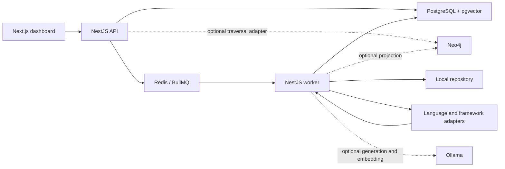
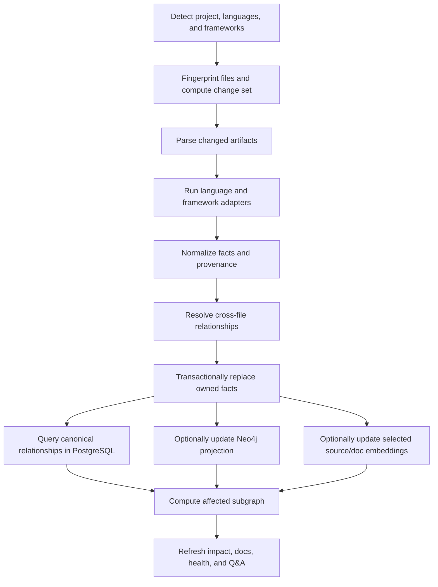

# IntelliRepo Portfolio Vertical Slice Design

> Historical design: the approved 2026-07-21 runtime integration design supersedes this document's optional Neo4j projection. The implemented slice is PostgreSQL-only for canonical storage and traversal, with pgvector inside PostgreSQL.

**Status:** Approved design baseline

**Date:** 2026-07-15

**Architecture revision:** 2026-07-16

**Delivery target:** Twelve weeks, solo implementation

**Primary mode:** Local-first, with optional GitHub pull request analysis

## 1. Purpose

IntelliRepo is a codebase intelligence platform that turns a repository into traceable entities, relationships, documentation claims, and change impacts. The portfolio release must demonstrate three connected capabilities:

1. Explore a repository through a queryable code graph and grounded questions.
2. Apply a code change and explain its impact on APIs, tests, configuration, and documentation.
3. Generate or repair documentation using verified facts and reviewable local diffs.

The release is successful when a clean local setup can index a medium repository, explore its structure, answer evidence-backed questions, incrementally process a prepared change, identify affected APIs/tests/docs, flag a stale claim, and generate a reviewed correction.

## 2. Scope and constraints

### Included

- Java, Kotlin, and TypeScript source analysis.
- Spring Boot, Ktor, Vert.x, NestJS, and Express framework adapters.
- Repositories up to approximately 100,000 lines or 2,000 source files.
- Local Git repositories and working-tree changes.
- Optional GitHub pull request diff ingestion and one idempotent analysis comment.
- Incremental fact replacement, canonical PostgreSQL traversal, optional graph projection, and affected-subgraph calculation.
- API discovery, test recommendations, documentation impact, and explainable risk scoring.
- Markdown generation, stale-claim detection, missing-documentation detection, and Mermaid diagrams.
- Graph exploration, hybrid codebase Q&A, and a documentation-health dashboard.
- Selective source/documentation embeddings and optional local inference through Ollama.
- Docker Compose setup and versioned sample/fixture repositories.

### Deferred

- Generated documentation pull requests and automatic merging.
- Hosted multi-tenant operation and organization administration.
- Compiler-grade resolution for every dynamic, reflective, or metaprogrammed construct.
- Full repository-history graphs and arbitrary historical time travel.
- Languages beyond Java, Kotlin, and TypeScript.
- Documentation formats other than Markdown.
- Unrestricted model-generated Cypher.
- A complete GitHub App product with checks, installation management, and webhook orchestration.
- Guaranteed request or response schemas when they cannot be inferred statically.

## 3. Architecture

The product is a TypeScript monorepo implemented as a modular monolith. It has three deployable processes built from shared modules:

- A Next.js web application.
- A NestJS HTTP application.
- A NestJS standalone worker for parsing, projection, analysis, embeddings, and generation.

Docker Compose requires PostgreSQL with the pgvector extension and Redis for the local application processes. Neo4j is an optional graph-query projection, not a required store. Ollama may run on the host or as an optional Compose profile. The canonical and deterministic product workflows must run when both optional dependencies are unavailable.



### Monorepo layout

```text
apps/
  web/                 Next.js dashboard
  api/                 NestJS HTTP and GitHub integration
  worker/              Indexing, analysis, and generation jobs

packages/
  domain/              Canonical entities, relationships, confidence, provenance
  repository/          Local Git and optional GitHub adapters
  parsing/             Parsing pipeline and language/framework adapters
  graph/               Traversal interface, PostgreSQL adapter, and optional Neo4j projection
  catalog/             Repository, job, document, scan, and fact metadata
  embeddings/          Selective source/doc chunking and PostgreSQL pgvector retrieval
  impact/              Change, test, documentation, and risk analysis
  documentation/       Generation, claim extraction, and stale-doc detection
  qa/                  Graph-plus-vector retrieval and grounded answers
  ai/                  Ollama model and embedding adapter
  contracts/           Job payloads and web-facing DTOs
  observability/       Structured logs, metrics, and job diagnostics
```

### Principal interfaces

The external seams remain intentionally small:

```typescript
interface RepositoryIndexer {
  indexSnapshot(input: IndexSnapshotInput): Promise<IndexResult>;
  applyChangeSet(input: ApplyChangeSetInput): Promise<IndexResult>;
}

interface ImpactAnalyzer {
  analyze(input: ImpactAnalysisInput): Promise<ImpactReport>;
}

interface DocumentationReconciler {
  reconcile(input: ReconcileDocumentationInput): Promise<DocumentationReview>;
}

interface RepositoryQuestionAnswerer {
  answer(input: RepositoryQuestion): Promise<GroundedAnswer>;
}
```

The graph module presents one bounded traversal interface to impact analysis, exploration, and Q&A. Its mandatory PostgreSQL adapter reads canonical relationships; its optional Neo4j adapter may accelerate the same query shapes without changing caller behavior or result semantics.

Framework adapters consume syntax-tree and symbol information and emit normalized facts. They do not write to storage directly. Fact ownership, provenance, confidence, persistence, and graph projection remain centralized.

## 4. Canonical intelligence model

The canonical vocabulary is defined in the repository root `CONTEXT.md`. The implementation must preserve these invariants:

- Every fact belongs to one repository and is supported by provenance.
- Every fact derived from source has a source artifact owner.
- Replacing or deleting an artifact replaces or removes all facts it owns.
- Stable entity identifiers derive from repository identity, language, entity kind, and qualified symbol identity.
- Anonymous or file-local entities use a deterministic syntax path.
- Confirmed, inferred, and tentative facts are distinguishable in storage and presentation.
- Low-confidence relationships are never phrased as certain facts.

Initial entity kinds include repository, module, package, file, class, interface, object, function, method, endpoint, middleware, test, configuration key, environment variable, dependency, build script, documentation page, and documentation section.

Initial relationship kinds include `CONTAINS`, `DECLARES`, `IMPORTS`, `EXTENDS`, `IMPLEMENTS`, `CALLS`, `HANDLES`, `USES_MIDDLEWARE`, `READS_CONFIG`, `TESTS`, `DOCUMENTS`, and `DEPENDS_ON`.

All source-derived entities and relationships record repository revision, file path, line range, extractor, evidence kind, confidence classification, and numeric score.

## 5. Indexing and projection flow

PostgreSQL is the mandatory source of truth for extracted facts and operational state. The pgvector extension runs inside that same PostgreSQL service; IntelliRepo does not require a separate vector database. Canonical relationships support a bounded PostgreSQL traversal adapter, so deterministic impact, test, documentation, risk, and exploration workflows do not depend on Neo4j. Neo4j is an optional, rebuildable, incrementally maintained traversal projection. Selective pgvector embeddings are a rebuildable semantic projection.



The indexer detects added, modified, deleted, and renamed artifacts using Git metadata plus content hashes. Only changed artifacts are parsed. Cross-file resolution is recalculated for relationships whose source or target could be affected.

Extracted facts are staged before one PostgreSQL transaction replaces the active facts owned by affected artifacts. A transactional outbox drives optional Neo4j and semantic projections. Jobs and projection writes are idempotent and revision-tagged. Deterministic analysis reads the active canonical revision through the PostgreSQL traversal adapter and never waits for an optional projection. When Neo4j is enabled and current, the traversal interface may select it; when it is disabled, unavailable, or stale, the same request falls back to PostgreSQL.

If a projection fails, canonical facts remain valid and deterministic workflows continue. The last completed optional projection remains identifiable but must not be presented as current. The dashboard reports the canonical revision, each projection revision, lag, disabled/unavailable status, fallback adapter, and degraded capabilities. Retrying resumes from the failed stage without duplicating facts or relationships.

## 6. Parsing and framework adapters

Extraction has two layers:

1. Language extractors identify packages, imports, types, functions, methods, calls, tests, documentation, configuration use, and source locations.
2. Framework adapters interpret annotations, decorators, routing DSLs, middleware, authentication, and framework test constructs.

### Language strategy

- Java uses Tree-sitter plus package, import, inheritance, annotation, and local symbol resolution.
- Kotlin uses Tree-sitter plus Kotlin import, class, object, extension-function, annotation, and DSL analysis.
- TypeScript uses the TypeScript Compiler API for stronger symbol/type resolution, with Tree-sitter as a fault-tolerant fallback.

### Framework support

| Adapter     | Supported patterns                                                                                              |
| ----------- | --------------------------------------------------------------------------------------------------------------- |
| Spring Boot | Controllers, composed mappings, request/response types, services, repositories, configuration properties, tests |
| Ktor        | `routing`, nested `route`, verb blocks, handlers, plugins, and authentication blocks                            |
| Vert.x      | Router declarations, route paths, methods, handler chains, verticles, and configuration access                  |
| NestJS      | Controllers, route decorators, providers, guards, interceptors, pipes, DTOs, and tests                          |
| Express     | App/router methods, nested routers, middleware chains, handlers, and environment variables                      |

Endpoint facts normalize HTTP method, resolved path, declared path, handler, inferred request/response types, middleware, authentication, source reference, and confidence.

Runtime-generated routes, reflection-heavy injection, metaprogramming, and unresolved external calls are reported as unsupported or tentative instead of guessed.

Acceptance targets for curated fixtures are at least 95% precision for directly declared endpoints, at least 90% recall for explicitly supported routing patterns, and complete source path/line provenance for all emitted entities.

## 7. Documentation intelligence

Generated documentation uses the following default paths:

```text
docs/intellirepo/
  onboarding.md
  architecture/overview.md
  modules/<module>.md
  api/<endpoint-slug>.md
  configuration.md
  changes/<revision>.md
```

Every generated page includes an AI-generated notice, indexed revision, confirmed facts, clearly marked inference, source references, and a machine-readable manifest of contributing entities. Mermaid diagrams are rendered from canonical relationships, not invented by the language model or made dependent on Neo4j.

Existing Markdown is parsed into sections and structured documentation claims. The MVP compares endpoint method/path, named entities, configuration keys and literal values, build/test commands, and code/document links with current facts.

Mismatch severity is deterministic:

- High: incorrect public endpoint, security/configuration value, or removed critical entity.
- Medium: changed behavior, dependency, setup command, or module relationship.
- Low: missing reference, renamed internal entity, or weakly linked prose.
- Informational: undocumented API, module, or configuration key.

Ollama explains verified mismatches and proposes replacement text. It does not determine whether the mismatch exists. Only documents connected to the affected subgraph are reassessed after a change. Manual documentation is never overwritten; changes appear as previews or reviewable local Git diffs.

## 8. Impact, test, and risk analysis

Impact analysis starts with a semantic fact diff. Explicit, weighted traversal rules calculate a bounded affected subgraph:

- A changed method reaches callers, its containing type, and related tests.
- A changed handler reaches its endpoint, middleware, service calls, API docs, and endpoint tests.
- A changed service reaches callers, dependent endpoints, and direct or indirect tests.
- A changed configuration key reaches consumers and linked documentation claims.
- A changed build dependency reaches importing modules and build/setup documentation.
- A deleted entity reaches all current relationships and documentation mentions.

Traversal has configurable depth and node-count limits. High-degree utility entities cannot mark the entire repository affected without explicit evidence.

Test recommendations combine direct calls/imports, test framework metadata, endpoint coverage, and naming conventions. Each result includes the graph path, reason, confidence, and ranking signals.

Risk scoring is deterministic and explainable. Factors include authentication/authorization changes, public endpoint changes, configuration changes, persistence changes, downstream relationship count, missing tests, stale or missing docs, unresolved symbols, and change size. Scores map to Low, Medium, or High and list every material contributor.

Local Git diffs are the primary input. Optional GitHub integration fetches a pull request diff, runs the same pipeline, and updates one comment identified by a hidden marker.

## 9. Exploration and question answering

The code explorer searches entities and requests bounded neighborhoods. Users can expand callers, callees, endpoints, tests, configuration, and documentation without rendering a full repository graph.

Question answering uses hybrid retrieval:

1. Classify the question into a supported structural intent.
2. Execute allowlisted traversal queries through the graph interface, using current Neo4j when available and PostgreSQL otherwise.
3. Retrieve related selected source and documentation chunks through pgvector when the semantic projection is available.
4. Build an evidence pack of facts, graph paths, snippets, confidence, and source references.
5. Return deterministic structural evidence directly when Ollama is unavailable, or ask Ollama to explain only that evidence when it is available.
6. Validate citations and label any derived explanation as inference; disclose unavailable semantic or model capabilities.

Supported intents initially include entity lookup, callers, callees, endpoint flow, configuration usage, test impact, documentation impact, and module explanation. Unknown questions fall back to semantic retrieval when available and otherwise return an explicit unsupported/degraded response. The model never generates unrestricted Cypher or SQL.

Embedding eligibility is deliberately narrow. The semantic projection includes redacted source spans useful for explanation and retrieval plus Markdown sections; it does not create one embedding per entity or relationship. Entity identity, relationships, confidence, and provenance remain structured canonical facts. Chunk-selection rules are deterministic, revision-aware, size-bounded, and observable.

## 10. Dashboard experience

The Next.js dashboard provides:

- Repository overview with revision, job health, entity counts, API counts, documentation health, and failures.
- Separate canonical, Neo4j, semantic, and Ollama status with projection revision, lag, fallback adapter, and degraded capabilities.
- Code explorer with entity search and bounded graph expansion.
- Documentation health with stale claims, gaps, severity, evidence, and suggestions.
- Change impact with semantic changes, affected entities, tests, documentation, risk, and review focus.
- Documentation workspace with generated pages, source references, previews, and local diffs.
- Ask IntelliRepo with evidence-backed answers, confidence, and source links.

The primary demo flow is:

```text
Index a sample repository
→ explore a login endpoint
→ ask how authentication works
→ apply a prepared code change
→ run incremental indexing
→ inspect affected APIs, tests, docs, and risk
→ detect an outdated documentation claim
→ generate a reviewed correction
→ ask the same question and receive updated evidence
```

## 11. Reliability, privacy, and observability

Indexing jobs transition through `QUEUED`, `DISCOVERING`, `PARSING`, `RESOLVING`, `COMMITTING_FACTS`, optional `PROJECTING_GRAPH`, optional `EMBEDDING`, `ANALYZING`, and `COMPLETED`. A disabled optional stage is recorded as skipped; its failure records lag and degraded capabilities without invalidating the canonical revision. Failures retain their completed stage, diagnostics, revision, and retry metadata.

Neo4j and Ollama are optional local dependencies. Structural indexing, route discovery, PostgreSQL-backed graph exploration, deterministic stale checks, test recommendations, impact scoring, fact-only documentation, and structural evidence responses remain available when they are offline. Documentation prose, suggested rewrites, semantic-only retrieval, and natural-language answers report a degraded state. Structured model output is schema-validated and retried once.

Repository controls respect `.gitignore` and IntelliRepo exclusions, skip binaries/generated directories/oversized files, reject symlinks escaping the repository root, and avoid `.env` contents by default. Likely secret values are redacted before embeddings or prompts. Repository content remains local. GitHub credentials are accepted through runtime secrets and are never indexed.

Structured logs carry repository, revision, scan, and job identifiers. The dashboard exposes failed stages and retries.

Performance goals on a typical modern developer laptop are:

- Initial structural indexing below five minutes for the target repository size.
- Incremental structural indexing below 30 seconds for fewer than 20 changed files.
- Bounded traversal queries below two seconds on the configured adapter.
- Deterministic impact analysis below ten seconds from the canonical revision without requiring optional projections.
- Endpoint-flow and affected-subgraph queries benchmarked on both PostgreSQL and Neo4j with equivalent bounded results; observed latency and operational trade-offs are recorded rather than assuming Neo4j is faster.
- Ollama latency reported separately because it depends on model and hardware.

## 12. Verification

- Unit tests cover identifiers, normalization, confidence, claim comparison, traversal, ranking, and risk.
- Extractor contract tests require every adapter to emit the canonical fact schema and valid provenance.
- Golden fixtures cover supported patterns for all five framework adapters.
- Integration tests cover PostgreSQL replacement and traversal, transactional outbox, optional Neo4j projection/equivalence, selective pgvector retrieval, and BullMQ retries.
- End-to-end tests index a fixture, apply a prepared Git change, and verify that only changed artifacts are reparsed and affected outputs are refreshed.
- Playwright tests cover the portfolio walkthrough and job recovery.
- Performance tests detect accidental full re-indexing and validate the medium-repository target.
- Recorded GitHub payloads and mocked API calls validate diff ingestion and idempotent comment updates.
- Required AI assertions use a deterministic fake model; Ollama compatibility is covered by an optional smoke suite.
- End-to-end acceptance runs once with PostgreSQL/Redis only and once with optional Neo4j/Ollama capabilities enabled.

Release acceptance requires the complete demo to run from a clean documented setup with framework fixtures and a prepared incremental-change scenario.

## 13. Twelve-week delivery sequence

| Weeks | Outcome                                                                                                    |
| ----- | ---------------------------------------------------------------------------------------------------------- |
| 1–2   | Monorepo, Compose services, canonical model, repository registration, project detection, and job lifecycle |
| 3–4   | Java, Kotlin, and TypeScript extraction with normalized facts and provenance                               |
| 5     | Five framework adapters with golden fixtures                                                               |
| 6     | Canonical fact store, PostgreSQL traversal, optional Neo4j projection, and affected-subgraph queries       |
| 7     | Semantic change diff, test recommendations, documentation impact, and risk scoring                         |
| 8     | Markdown generation, claim extraction, stale/gap detection, and Mermaid output                             |
| 9     | Selective pgvector retrieval, optional Ollama integration, grounded Q&A, and degraded mode                 |
| 10    | Six dashboard experiences and the integrated demo flow                                                     |
| 11    | Local Git workflow, GitHub PR analysis, privacy controls, and performance tuning                           |
| 12    | End-to-end hardening, demo fixtures, onboarding, screenshots, and release polish                           |

## 14. Design decisions

- A modular monolith is preferred over microservices because it preserves clean interfaces without spending the twelve-week schedule on distributed operations.
- PostgreSQL is mandatory and owns canonical facts. pgvector is an extension of that same store rather than a separate vector service.
- The graph seam has a mandatory PostgreSQL traversal adapter and an optional Neo4j adapter. Neo4j remains rebuildable and cannot be required by deterministic features.
- Deterministic extraction, traversal, comparison, impact, test, documentation-health, and risk features establish truth and remain usable without Ollama; local AI only explains verified facts and improves prose.
- Embeddings are limited to useful redacted source spans and documentation sections; structured entities and relationships are not embedded by default.
- Representative endpoint-flow and affected-subgraph traversals are benchmarked on both adapters before making any deployment recommendation.
- Framework variation lives behind extraction adapters. The canonical model and persistence modules remain language-neutral.
- The portfolio experience is one end-to-end change story, not three disconnected demonstrations.
